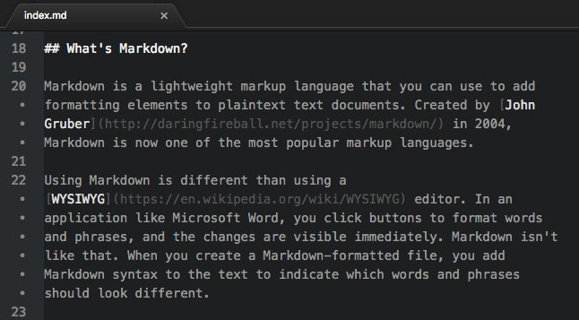

## Exercice MarkDown Group

### Collaborators :
* [Meilyn ANDRADE](github.io/Meilyn)
* [Jean OIKONOMOU](https://github.com/Jean-OIKONOMOU)
* [Audrey KREMERS](https://github.com/AudreyKremers)
* [Joseph ISMAIL](https://github.com/Fesouille)

### When:
11 January 2019

### Where:
BeCode Junior Web Developper.

### Languages:
English, Spanish, Greck and French

### What’s Markdown?
Markdown is a lightweight markup language that you can use to add formatting elements to plaintext text documents. Created by John Gruber in 2004, Markdown is now one of the world’s most popular markup languages.

Using Markdown is different than using a [WYSIWYG](https://en.wikipedia.org/wiki/WYSIWYG) editor. In an application like Microsoft Word, you click buttons to format words and phrases, and the changes are visible immediately. Markdown isn’t like that. When you create a Markdown-formatted file, you add Markdown syntax to the text to indicate which words and phrases should look different.

# Make a README
#### Because no one can read your mind (yet).

## Español

Markdown es un lenguaje de marcado ligero creado por John Gruber que trata de conseguir la máxima legibilidad y facilidad de publicación tanto en su forma de entrada como de salida, inspirándose en muchas convenciones existentes para marcar mensajes de correo electrónico usando texto plano. Se distribuye bajo licencia BSD y se distribuye como plugin (o al menos está disponible) en diferentes sistemas de gestión de contenidos (CMS). Markdown convierte el texto marcado en documentos XHTML utilizando html2text creado por Aaron Swartz [1]. Markdown fue implementado originariamente en Perl por Gruber, pero desde entonces ha sido traducido a multitud de lenguajes de programación, incluyendo PHP, Python, Ruby, Java y Common Lisp.

## Un poco de historia

John Gruber creó el lenguaje Markdown en 2004, con una ayuda importante de Aaron Swartz en la sintaxis. Gruber tenía la meta de hacer que la gente "pudiera escribir usando un formato de texto plano fácil-de-leer y fácil-de-escribir, y con la posibilidad de poder convertir su documento en XHTML (o HTML) válido”.

La clave del diseño de Markdown es la facilidad de su lectura –que hace que el lenguaje sea fácilmente interpretado, sin lucir como si hubiera sido marcado con etiquetas o instrucciones de estilo, como RTF o HTML, los cuales tienen etiquetas que hacen más difícil su lectura e interpretación. Por ello, su inspiración más importante son las convenciones existentes para formatear texto plano en los emails, aunque también toma características de lenguajes anteriores, como setext, atx (por Aaron Swartz), Textile, reStructuredText, Grutatext, and EtText.

Gruber escribió un script en Perl, Markdown.pl, que convierte texto Markdown válido en un documento XHTML bien-formado o HTML, y remplazan las comillas angulares de apertura ('<') y el símbolo "&" con sus correspondientes entidades.

Markdown desde entonces ha sido implementado como un módulo de Perl disponible en la CPAN (Text::Markdown), y también ha sido portado en una variedad de lenguajes de programación. Está distribuido bajo la licencia BSD, y está incluido, o disponible como un plugin para muchos sistemas de gestión de contenidos.

Una cantidad de sitios como GitHub, Reddit, Diaspora, Stack Exchange, OpenStreetMap, y SourceForge usa algunas variantes de Markdown para facilitar la discusión entre usuarios. Un dialecto de Markdown es también usada por el sistema de mensajería instantánea Slack.

### Liste numerotée [Jean]
1. κανο
2. μαρκδοεν
3. καταλαβεσ;
4. αδε κλ κλ
5. σε αδαπο ❤
6. markdown is garbage :)
7. dh
8. ht
9. ht

## Un éditeur de texte format voyage ?
Voici un lien vers l'app **Markor** pour vous entrainer sur votre portable type Android :

*Cliquez sur l'image !*

